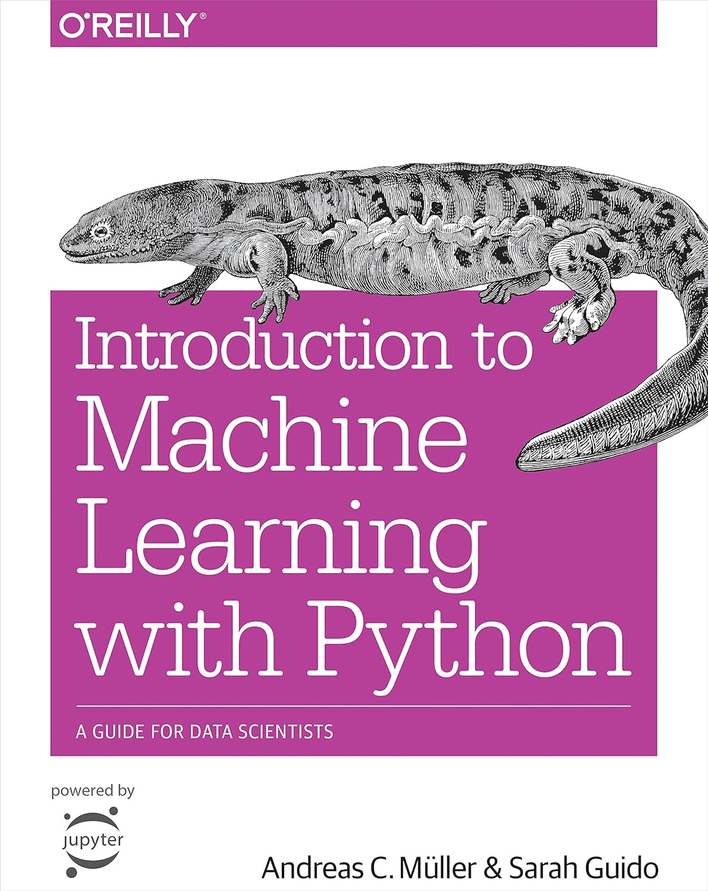

# Introduction to Machine Learning with Python

This repository contains chapter summaries, practical implementations, and visualizations based on the book:

**Introduction to Machine Learning with Python**  
Original Authors by Andreas C. Müller & Sarah Guido

---

## Project Objectives

- Understand core machine learning concepts
- Implement models using Python and Scikit-Learn
- Visualize model results
- Build a structured learning portfolio

---

## Chapters

| No | Topic |
|----|------|
| 01 | Introduction |
| 02 | Supervised Learning |
| 03 | Unsupervised Learning |
| 04 | Model Evaluation |
| 05 | Pipelines |
| 06 | Feature Engineering |
| 07 | Working with Text Data |
| 08 | Final Summary & Model Comparison |

---

## Tools & Libraries

- Python
- Google Colab
- Pandas
- NumPy
- Matplotlib
- Seaborn
- Scikit-Learn

---

## Highlights

- Classification using KNN
- Clustering with K-Means
- Confusion Matrix Visualization
- Pipeline Workflow
- Feature Importance Analysis
- Text Classification using Naive Bayes
- Model Comparison Dashboard

---

## Conclusion

Machine learning combines data, algorithms, and evaluation techniques to create predictive systems. Proper preprocessing, model selection, and visualization are essential for good performance.

---

## Author

Mohammad Fauzi Hadiwijaya
